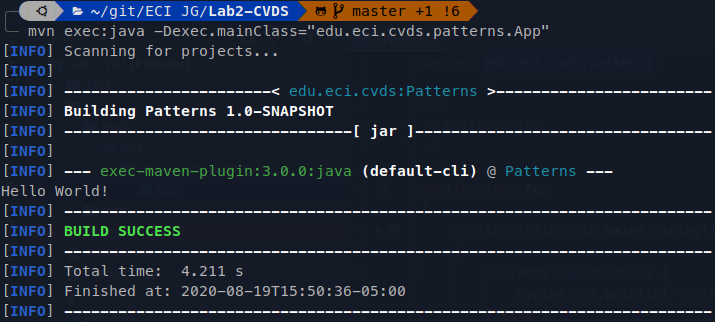
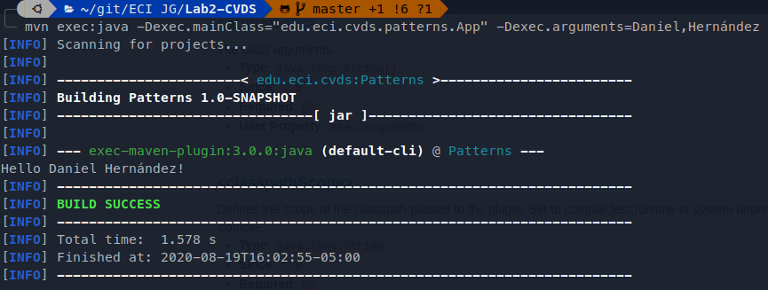
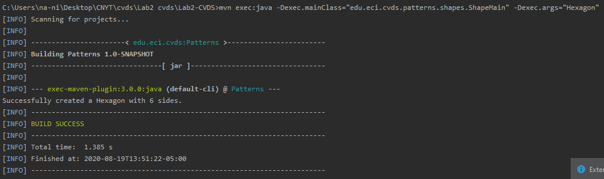
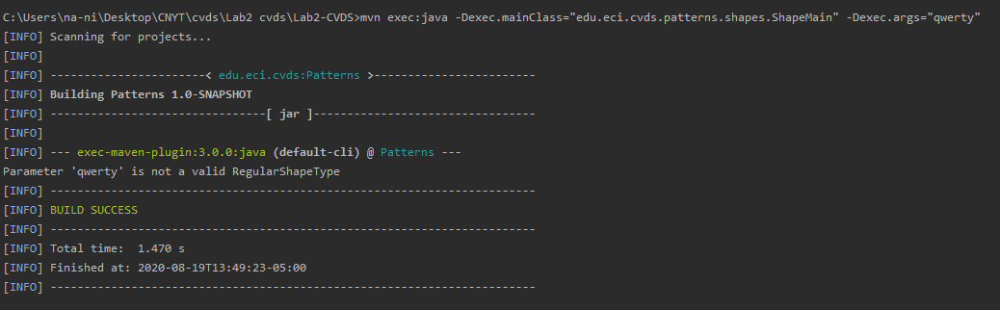
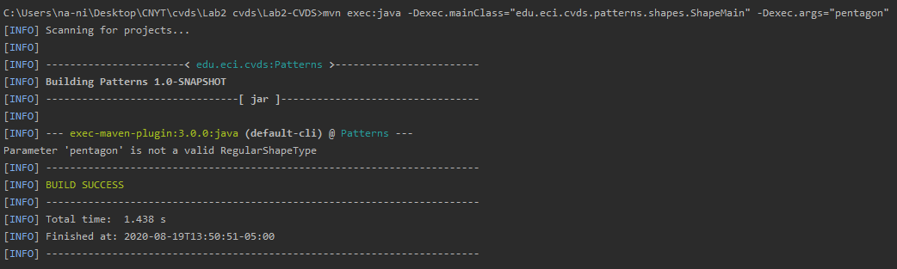

## Apache Maven

# ¿ Cual es su mayor utilidad ?

Maven permite que un desarrollador comprenda el estado completo de un esfuerzo
de desarrollo en el periodo de tiempo más corto. por lo que Maven se ocupa de varias areas

* Facilitando el proceso de construcción
> Maven no elimina la necesidad de conocer los mecanismos subyacentes, Maven protege a los desarrolladores de muchos detalles.

* Proporcionando un sistema de construcción uniforme
> Maven crea un proyecto utilizando su modelo de objetos de proyecto (POM) y un conjunto de complementos. Una vez que se familiarice con un proyecto de Maven, sabrá cómo se construyen todos los proyectos de Maven. Esto ahorra tiempo al navegar por muchos proyectos.

* Proporcionando información de calidad sobre el proyecto
> Maven proporciona información útil del proyecto que en parte se toma de su POM y en parte se genera a partir de las fuentes de su proyecto. Por ejemplo, Maven puede proporcionar:
> * Cambio de registro creado directamente desde el control de fuente
> * Fuentes con referencias cruzadas
> * Listas de correo gestionadas por el proyecto
> * Dependencias utilizadas por el proyecto
> * Informes de prueba unitaria que incluyen cobertura

* Fomentar mejores prácticas de desarrollo
> Maven tiene como objetivo recopilar los principios actuales para el desarrollo de mejores prácticas y facilitar la orientación de un proyecto en esa dirección.
>Por ejemplo, la especificación, ejecución y generación de informes de las pruebas unitarias son parte del ciclo de compilación normal con Maven.

# Fases de Maven
Los objetivos se ejecutan en fases que ayudan a determinar el orden en que se ejecutan los objetivos. La mejor comprensión de esto es observar los enlaces de ciclo de vida de Maven predeterminados que muestran qué objetivos se ejecutan en qué fases de forma predeterminada.
Los objetivos de la fase de compilación siempre se ejecutarán antes de los objetivos de la fase de prueba, que siempre se ejecutarán antes de los objetivos de la fase del paquete y así sucesivamente.

### Fases

* Fase de compilación
* Fase de prueba
* Fase de paquetes

# Ciclos de vida de la construcción

Las partes del ciclo de vida principal del proyecto Maven son:

1. Compile: genera los ficheros .class compilando las fuentes .java.
2. Test: ejecuta los tests automáticos de JUnit existentes.
3. Package: genera el fichero .jar con los .class compilados.
4. Install: copia el fichero .jar de esta forma esos .jar pueden utilizarse en otros proyectos Maven en el mismo ordenador.
5. Deploy: copia el fichero .jar a un servidor remoto, poniéndolo disponible para cualquier proyecto Maven con acceso a ese servidor remoto.

# Para que sirven los Plugins

El compiler plugin de apache es utilizado para compilar el código fuente del proyecto.

¿ Porque es importante?

* La configuración default del código fuente es 1.5 de tal modo que la aplicación utiliza cualquier novedad de java 1.6 o superior el código fuente no compilara.
* Puede ser utilizado para forzar al proyecto a utilizar una versión de Java a la que se tiene configurado en el equipo.

# ¿ Que es y para que sirve el repositorio central de Maven?

Un repositorio Maven es una estructura de directorios que contiene los plugins y sus dependencias organizadas por **groupId** y **artifactId**.
El [repositorio principal de Maven](https://es.wikipedia.org/wiki/Maven) contiene las librerías de uso general.

## referencias

- [referencia 1](https://es.wikipedia.org/wiki/Maven)
- [referencia 2](https://www.it-swarm.dev/es/maven/cuales-son-los-objetivos-y-fases-de-maven-y-cual-es-su-diferencia/1071905498/)
- [referencia 3](https://maven.apache.org/what-is-maven.html)
- [referencia 4](https://snmb-desarrollo.readthedocs.io/en/develop/howtos/maven-deploy.html#:~:text=Un%20repositorio%20Maven%20es%20una,las%20librer%C3%ADas%20de%20uso%20general.)

## Compilar y Ejecutar

* Ejecutar ```App.java``` sin parámetros:



* Ejecutar ```App.java``` con parámetros:



## Hacer el esqueleto de la aplicación

¿Cuál(es) de las anteriores instrucciones se ejecutan y funcionan correctamente y por qué?

**Sin parámetros**: imprime error por que es necesario un para crear las figuras.



**Parámetro: qwerty**: imprime error por que no es una figura en la enumeración.



**Parámetro: pentagon**: imprime error por que está mal escrita la palabra para poder crear la figura.



**Parámetro Hexagon**: imprime el numero de lados que tiene la figura por que es un figura de la enumeración.
    

